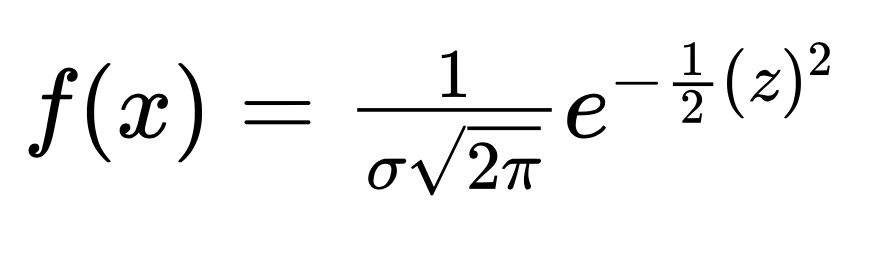
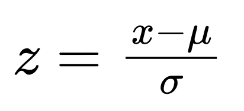
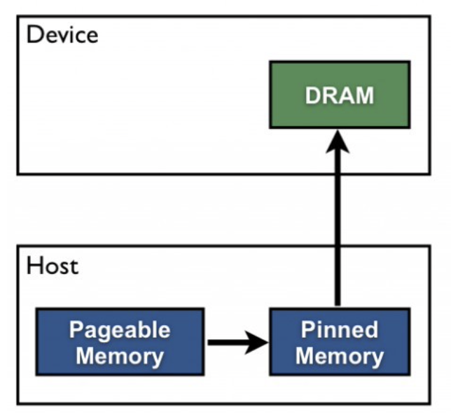
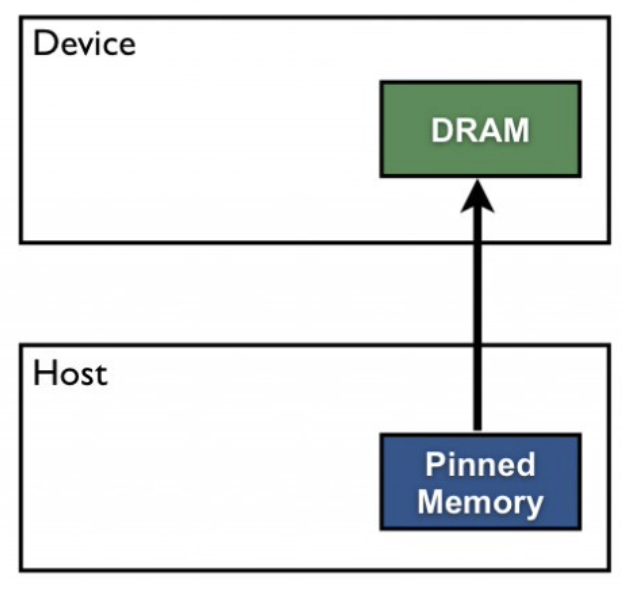

## TP4 : Programmation GPU en CUDA


### Objectifs du TP :
---------------------
* Comprendre comment executer des streams de façon concurrentes.
* Comparer l'execution du programme utilisant des nombres flottant en precision simple vs. en precision double.

### Informations sur le TP :
----------------------------
* Le TP est à réaliser seul ou en binôme.
* Un compte rendu du TP sera à fournir avec le code (Latex, Word ou MarkDown)
* A rendre sur ametice en spécifiant si vous avez fait le TP seul ou en binôme, en mentionnant votre prénom ainsi que votre nom (prénom et nom de chaque membre si en binôme).
* A rendre avant le 01 Avril 2022, 24:00.


### Exercice 1 : Streams et execution asynchrone
------------------------------------------------

* Vous programmerez sur le fichier **exercice01.cu**

L'objectif de ce TP est d'executer une version concurrente du code en utilisant les **streams** de CUDA.

le code fournit effectue un calcul par élément sur un vecteur 1D. Chaque thread opère sur un élément du vecteur.

Le kernel calcul la moyenne de la densite de probabilité sur un interval de valeurs autour de chaque élément.

la fonction de densité de probabilité est donnée par l'équation suivante :



ou z est la loi normale donnée par l'équation :



une loi normale de moyenne (**mean**) nulle, et d'ecart type (**sigma**) unitaire est appelée **loi normale centrée réduite** ou **loi normale standard**. Dans le code, mean est fixée à 0 et sigma à 1, donc z est une loi normale standard.

Pour ce TP, il n'est pas de connaitre ces notions qui sont déjà implementés. Je laisse neanmoins le lien suivant pour ceux à qui ça intéresse. [Loi normale](https://fr.wikipedia.org/wiki/Loi_normale)

#### 1.1. Mémoire paginée et mémoire épinglé

##### 1.1.1. Memoiré paginée

Dans le code, la mémoire pour les vecteurs **host** h_x, h_y et h_y1 est alloué via la fonction malloc. La mémoire alloué par malloc est paginable.

la fonction **cudaMemcpy** convertie implicitement la mémoire paginable en mémoire épinglé temporaire. C'est à dire que cette mémoire restera present sur la mémoire vive de l'ordinateur pendant toute l'execution du programme. 

Deux transferts de mémoire sont effetués. Par conséquent, ce type d'allocation et de transfert de mémoire est lent.



Compilez et Executez le programme. 
relevez le temps d'execution en sortie du programme.

##### 1.1.2. mémoire partagée. 

Nous avons vue en CM qu'il est possible de directement allouer de la mémoire épinglé via **cudaMallocHost()**. En passant par cette fonction nous n'avons qu'un seul transfert de mémoire.



L'inconvénient est que, comme les données sont initialisées dans la mémoire épinglée, la disponibilité de la mémoire pour le CPU est réduite.

Modifiez le code de sorte à n'utiliser que de la mémoire épingler via **cudaHostMalloc()**. N'oubliez pas de changer la façon dont on libère la mémoire en fin de programme.

Executez à nouveau le programme, que constatez-vous sur le temps d'exécution ?


#### 1.2. Streams

Vous allez maintenant modifier le programme afin de rendre possible l'execution asynchrone entre les copies CPU <--> GPU et les kernels.

Le but etant de diviser le vecteurs 1D h_x en un sous\_ensemble de vecteurs definit par la variable constante **subpart**. Un stream s'occupera d'un sous-vecteur à la fois.

```c
typedef float ft;
const int sub_parts = 64;
const size_t ds = 1024*1024*sub_parts;
const int count = 22;
const int num_streams = 8;
```

Dans le code, differentes constantes ont été déclarés:

- **ft** : type utilisé pour declarer nos variables dans le code (changer float par double pour utiliser la précision double)
- **sub_paths** : Permet de diviser notre vecteur en un sous-ensemble de vecteurs.
- **ds** : Correspond à la taille totale du vecteur. Dans la partie streams du TP, sub_parts permet d'avoir 64 vecteurs de taille 1024*1024 
- **count** : Permet de définir la taille de l'interval de valeurs utilisé pour calculer la moyenne de la probabilité de densité.
- **num_streams** : Correspond au nombre de streams que l'on veut lancer.

Vous ecrirez le code correspondant aux streams dans la partie délimité par **#ifdef USE_STREAM #endif**

```c
#ifdef USE_STREAMS

	// Code correspondant aux streams

#endif
```

##### 1.2.1 Creation et Destruction des streams

Ecrivez le code permettant de creer vos streams de tailles num_streams en utilisant la fonction **cudaStreamCreate()** :

```c
1.2.1 Execution des streams

```

Ecrivez le code permettant de creer vos streams de tailles num_streams en utilisant la fonction **cudaStreamDestroy()** :

```c
1.2.1 Destruction des streams

```

Pensez à vous assurer qu'il n'y ai pas d'erreur lors de la creation et destruction des streams, en appelant la fonction **cudaCheckErrors()**.

##### 1.2.2. Execution des streams

Pour chaque stream : 

- Faite une copie asynchrone CPU vers GPU du vecteur **h_x** dans **d_x** via **cudaMemcpyAsync()**.
- Lancer le kernel pour le stream courant
- Faite la copie GPU vers CPU du résultat **d_y** dans **h_y** via **cudaMemcpyAsync()**.

Pour rappel, chaque streams s'occupe d'un sous-ensemble du vecteur **h_x**. 

Si **h_x** est divisé en 64 sous-vecteurs et nous n'avons que 8 streams alors les treams 0, 1, 2, ..., 7 s'occuperont respectivement des sous-vecteurs 0, 1, 2, ... 7 puis des sous-vecteurs 8, 9, 10, ..., 15 et ainsi de suite... 
Pour les streams pensez à utiliser le module % :

- 0%4 = 0, 1%4 = 1, 2%4 = 2, 3%4 = 3
- 4%4 = 0, 5%4 = 1, 6%4 = 2, 7%4 = 3

Chaque sous-vecteur est de taille 1024x1024, donc : 

- Le stream 0 s'occupera du sous-vecteur 0 de taille 1024x1024 commençant par l'indice 0.
- Le stream 1 s'occupera du sous-vecteur 1 de taille 1024x1024 commençant par l'indice (1024x1024).
- Le stream 2 s'occupera du sous-vecteur 1 de taille 1024x1024 commençant par l'indice 2*(1024x1024).

Si vous exécuté le code, une étape de vérification sera effectué pour s'assurer que votre implémentation est correcte.

##### 1.2.3. Execution asynchrone

Pour executer le code en mode streams, rajouter le flag -DUSE_STREAMS lors de la compilation.

Dans le Makefile :

```c
NVCC_FLAGS= -DUSE_STREAMS -gencode arch=compute_60, code=compute_60

```

Sur le Makefile dans Google Colab :

```c
NVCC_FLAGS= -DUSE_STREAMS

```

Executez le code et comparez les temps d'execution non-streams vs. streams.

Que constatez-vous ?

##### 1.2.4. Modification les paramètres

```c
// 1.2.4 Modification des paramètres
typedef float ft;
const int sub_parts = 64;
const size_t ds = 1024*1024*sub_parts;
const int count = 22;
const int num_streams = 8;
```
Que se passe t'il au niveau du temps d'execution lorsque vous :

1. Changez **typedef float ft** par **typedef double ft** ?
2. Augmentez ou diminuez de manière considerable **sub_parts** ?
3. Changez la taille **ds** ?
3. Augmentez ou diminuez **count** ? 
4. Augmentez ou diminuez **num_streams** ? (nombre limité par GPU)


### Exercice 2 : Concurrence entre kernels
------------------------------------------------
Vous allez maintenant travaillez sur exercice02.cu (Ou section Exercice2 sur google colab).

Le code est fournit avec une kernel "dummy" qui a priori ne fait rien d'intéressant mais va vous permettre de comparer les performances entre une execution sequentielle de kernels et une execution concurrente de kernels. 

Parcourez le code et essayez de comprendre ce qu'il fait. Vous pouvez le compiler et l'executer pour voir le temps pris par l'execution séquentielle des kernels.

Il est possible de creer un tableau de streams de taille supérieur au nombre de streams total du GPU. Dans ce cas certaines executions seront mises en attente le temps que des streams se libèrent.

#### 2.1.
Implementez les parties 2.1, 2.2 et 2.3 du programme de sorte à lancer nblocks (30) kernels en simultanée.

#### 2.2.
Executez le programme, que remarquez-vous au niveau des temps d'executions ?


